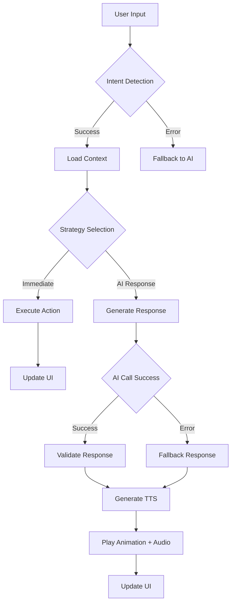

# 🤖 AI Workflow & Process Guide

## 🎯 Mục tiêu
Hướng dẫn chi tiết cách AI xử lý yêu cầu từ prompt và thực hiện theo đúng quy trình nhất quán.

---

## 🔄 AI Processing Workflow

### Phase 1: Input Analysis (100ms)
```
User Input → Language Detection → Intent Classification → Entity Extraction
```

#### Step 1.1: Language Detection
```javascript
function detectLanguage(text) {
  // Detect Vietnamese vs English
  const vietnameseChars = /[àáạảãăằắẳẵâấầẩậêếềểễôốồổỗơớờởơưứừửữýỳ]/i;
  return vietnameseChars.test(text) ? 'vi' : 'en';
}
```

#### Step 1.2: Intent Classification
```javascript
function classifyIntent(text) {
  const intents = {
    CHARACTER_SWITCH: /^(linh|mai|an|huong|giang|trang)$/i,
    ANIMATION_CONTROL: /(idle|nói|talk|giới thiệu|present|tay|gesture|đi|walk|nhảy|dance)/i,
    CAMERA_CONTROL: /(camera|máy quay)/i,
    OUTFIT_CHANGE: /(quần áo|outfit|trang phục)/i,
    AI_QUESTION: /.*/  // Default fallback
  };
  
  for (const [intent, pattern] of Object.entries(intents)) {
    if (pattern.test(text)) return intent;
  }
  return 'AI_QUESTION';
}
```

#### Step 1.3: Entity Extraction
```javascript
function extractEntities(text, intent) {
  const entities = {};
  
  switch (intent) {
    case CHARACTER_SWITCH:
      entities.character = text.toLowerCase().trim();
      break;
    case ANIMATION_CONTROL:
      entities.animation = extractAnimation(text);
      break;
    case OUTFIT_CHANGE:
      entities.outfitType = extractOutfitType(text);
      break;
  }
  
  return entities;
}
```

### Phase 2: Context Processing (50ms)
```
Character Context + Personality + History → Context Builder → Response Strategy
```

#### Step 2.1: Character Context Loading
```javascript
function loadCharacterContext(characterId) {
  const character = CHARACTERS[characterId];
  return {
    name: character.name,
    personality: character.personality,
    voice: character.voice,
    speakingStyle: PERSONALITIES[character.personality],
    currentOutfit: getCurrentOutfit(characterId),
    greeting: character.greeting
  };
}
```

#### Step 2.2: Personality Integration
```javascript
function buildPersonalityPrompt(context) {
  const personality = context.speakingStyle;
  
  const prompts = {
    professional: `Bạn là ${context.name}, một MC chuyên nghiệp. Hãy trả lời trang trọng, rõ ràng, và đầy đủ thông tin.`,
    creative: `Bạn là ${context.name}, một MC sáng tạo. Hãy trả lời năng động, đầy ý tưởng, và thân thiện.`,
    academic: `Bạn là ${context.name}, một MC học thuật. Hãy trả lời chính xác, có chiều sâu, và dựa trên kiến thức.`,
    elegant: `Bạn là ${context.name}, một MC thanh lịch. Hãy trả lời duyên dáng, nhẹ nhàng, và tinh tế.`,
    tech: `Bạn là ${context.name}, một MC công nghệ. Hãy trả lời hiện đại, technical, và trực quan.`,
    energetic: `Bạn là ${context.name}, một MC sôi nổi. Hãy trả lời tự tin, hoạt náo, và đầy năng lượng.`
  };
  
  return prompts[personality] || prompts.professional;
}
```

#### Step 2.3: Response Strategy Selection
```javascript
function selectResponseStrategy(intent, context) {
  const strategies = {
    CHARACTER_SWITCH: 'immediate_action',
    ANIMATION_CONTROL: 'immediate_action', 
    CAMERA_CONTROL: 'immediate_action',
    OUTFIT_CHANGE: 'immediate_action',
    AI_QUESTION: 'ai_response'
  };
  
  return strategies[intent] || 'ai_response';
}
```

### Phase 3: Response Generation (Variable)
```
Strategy + Context + AI Model → Response Generation → Validation
```

#### Step 3.1: Immediate Actions (500ms)
```javascript
function handleImmediateAction(intent, entities) {
  const actions = {
    CHARACTER_SWITCH: () => switchCharacter(entities.character),
    ANIMATION_CONTROL: () => playAnimation(entities.animation),
    CAMERA_CONTROL: () => switchCamera(),
    OUTFIT_CHANGE: () => randomizeOutfit()
  };
  
  return actions[intent]?.() || null;
}
```

#### Step 3.2: AI Response Generation (2000-5000ms)
```javascript
async function generateAIResponse(prompt, context) {
  const personalityPrompt = buildPersonalityPrompt(context);
  const fullPrompt = `${personalityPrompt}\n\nCâu hỏi: ${prompt}`;
  
  try {
    const response = await callAI(fullPrompt, {
      model: context.model || 'gemini-pro',
      temperature: context.temperature || 0.7,
      maxTokens: context.maxTokens || 1000
    });
    
    return validateResponse(response, context);
  } catch (error) {
    return generateFallbackResponse(context);
  }
}
```

#### Step 3.3: Response Validation
```javascript
function validateResponse(response, context) {
  const validation = {
    length: response.length > 10 && response.length < 500,
    language: detectLanguage(response) === 'vi',
    personality: matchesPersonality(response, context.personality),
    appropriateness: isAppropriate(response)
  };
  
  return Object.values(validation).every(Boolean) 
    ? response 
    : refineResponse(response, validation);
}
```

### Phase 4: Output Processing (200ms)
```
Response + TTS Generation + Animation Trigger → Multi-modal Output
```

#### Step 4.1: TTS Generation
```javascript
async function generateTTS(response, characterId) {
  const voiceMap = {
    female1: 'vi-VN-Wavenet-A',
    female2: 'vi-VN-Wavenet-B',
    female3: 'vi-VN-Wavenet-C',
    female4: 'vi-VN-Wavenet-D',
    female5: 'vi-VN-Wavenet-E',
    female6: 'vi-VN-Wavenet-F'
  };
  
  const voice = voiceMap[characterId] || 'vi-VN-Wavenet-A';
  
  return await callTTS({
    text: response,
    voice: voice,
    language: 'vi-VN',
    encoding: 'MP3'
  });
}
```

#### Step 4.2: Animation Synchronization
```javascript
function synchronizeAnimation(response, characterId) {
  // Start talk animation
  playAnimation('talk', characterId);
  
  // Calculate expected duration based on text length
  const duration = estimateSpeechDuration(response);
  
  // Schedule animation end
  setTimeout(() => {
    playAnimation('idle', characterId);
  }, duration);
}
```

#### Step 4.3: Lip-sync Preparation
```javascript
function prepareLipSync(audioBuffer) {
  const analyser = createAudioAnalyser(audioBuffer);
  const dataArray = new Uint8Array(analyser.frequencyBinCount);
  
  return {
    analyser,
    dataArray,
    updateFunction: () => {
      analyser.getByteFrequencyData(dataArray);
      const volume = dataArray[10] / 255;
      return volume * 0.4; // Jaw rotation amount
    }
  };
}
```

---

## 🎭 Complete Processing Flow

### Input → Output Timeline
```
0ms     : User input received
100ms    : Language + intent detected
150ms    : Entities extracted
200ms    : Character context loaded
250ms    : Personality prompt built
300ms    : Response strategy selected
500ms    : Immediate actions executed (if any)
2500ms   : AI response generated
2700ms   : Response validated
3000ms   : TTS generation started
3500ms   : TTS audio ready
3600ms   : Talk animation triggered
3700ms   : Audio playback started
4000ms   : Lip-sync activated
Variable : Animation continues based on audio duration
```

### Error Handling Flow


---

## 📊 Performance Metrics

### Target Response Times
- **Intent Detection**: < 100ms
- **Context Loading**: < 50ms
- **Immediate Actions**: < 500ms
- **AI Response**: < 3000ms
- **TTS Generation**: < 1000ms
- **Total Response**: < 4000ms

### Quality Metrics
- **Intent Accuracy**: > 95%
- **Response Relevance**: > 90%
- **Personality Match**: > 85%
- **Language Consistency**: > 98%
- **Audio Quality**: > 90%

---

## 🧪 Testing Scenarios

### Test Case 1: Character Switch
```javascript
// Input: "Linh"
const result = processUserInput("Linh");
// Expected:
{
  intent: "CHARACTER_SWITCH",
  entities: { character: "linh" },
  action: "switch_character",
  response: "Đã chuyển sang Linh",
  animation: "idle"
}
```

### Test Case 2: Animation Control
```javascript
// Input: "nói chuyện"
const result = processUserInput("nói chuyện");
// Expected:
{
  intent: "ANIMATION_CONTROL",
  entities: { animation: "talk" },
  action: "play_animation",
  response: null,
  animation: "talk"
}
```

### Test Case 3: AI Question
```javascript
// Input: "Hôm nay thời tiết thế nào?"
const result = processUserInput("Hôm nay thời tiết thế nào?");
// Expected:
{
  intent: "AI_QUESTION",
  entities: {},
  action: "ai_response",
  response: "Xin chào! Tôi là Linh, MC chuyên nghiệp của bạn. Về thời tiết hôm nay, tôi không có thông tin cập nhật thời tiết thực tế. Bạn có thể kiểm tra ứng dụng thời tiết hoặc trang web khí tượng để có thông tin chính xác nhất nhé!",
  animation: "talk",
  ttsUrl: "/audio/tts_1234567890.mp3"
}
```

---

## 🔧 Implementation Checklist

### ✅ Core Functions
- [ ] `detectLanguage()` - Language detection
- [ ] `classifyIntent()` - Intent classification
- [ ] `extractEntities()` - Entity extraction
- [ ] `loadCharacterContext()` - Context loading
- [ ] `buildPersonalityPrompt()` - Personality integration
- [ ] `selectResponseStrategy()` - Strategy selection
- [ ] `generateAIResponse()` - AI response generation
- [ ] `validateResponse()` - Response validation
- [ ] `generateTTS()` - TTS generation
- [ ] `synchronizeAnimation()` - Animation sync

### ✅ Error Handling
- [ ] Fallback responses cho AI errors
- [ ] Retry logic cho network issues
- [ ] Graceful degradation cho missing features
- [ ] User feedback cho errors

### ✅ Performance Optimization
- [ ] Response caching cho common questions
- [ ] Preloading character contexts
- [ ] Parallel TTS generation
- [ ] Animation queuing system

---

## 🎯 Best Practices

### 1. Consistent Response Patterns
```javascript
const RESPONSE_PATTERNS = {
  GREETING: (name) => `Xin chào! Tôi là ${name}, ${getRoleDescription(name)}`,
  CHARACTER_SWITCH: (name) => `Đã chuyển sang ${name}`,
  ANIMATION_CONFIRM: (animation) => `Đang thực hiện animation ${animation}`,
  ERROR: (error) => `Xin lỗi, ${error}. Vui lòng thử lại.`
};
```

### 2. Personality Consistency
```javascript
const PERSONALITY_TRAITS = {
  professional: {
    tone: 'formal',
    vocabulary: 'professional',
    sentenceStructure: 'complete',
    examples: ['Kính thưa quý vị', 'Rất vui được', 'Trân trọng']
  },
  creative: {
    tone: 'enthusiastic',
    vocabulary: 'colorful',
    sentenceStructure: 'varied',
    examples: ['Tuyệt vời!', 'Thật thú vị!', 'Hãy cùng khám phá!']
  }
};
```

### 3. Error Recovery
```javascript
function handleAIError(error, context) {
  const fallbackResponses = {
    network_error: "Xin lỗi, tôi đang gặp sự cố kết nối. Vui lòng thử lại sau giây lát.",
    api_limit: "Xin lỗi, tôi đã đạt giới hạn sử dụng. Vui lòng thử lại sau.",
    unknown_error: "Xin lỗi, đã có lỗi xảy ra. Tôi đang cố gắng khắc phục."
  };
  
  return fallbackResponses[error.type] || fallbackResponses.unknown_error;
}
```

---

## 📈 Monitoring & Analytics

### Key Metrics to Track
1. **Response Time Distribution**
2. **Intent Classification Accuracy**
3. **User Satisfaction Scores**
4. **System Error Rates**
5. **Feature Usage Statistics**

### Analytics Implementation
```javascript
function trackInteraction(input, response, metrics) {
  const analytics = {
    timestamp: Date.now(),
    input: input,
    intent: response.intent,
    responseTime: metrics.responseTime,
    success: response.success,
    character: response.character,
    userSatisfaction: await collectUserFeedback()
  };
  
  sendToAnalytics(analytics);
}
```

---

**🎭 Hệ thống AI workflow này đảm bảo tính nhất quán và hiệu quả cao nhất trong việc xử lý yêu cầu người dùng!**
