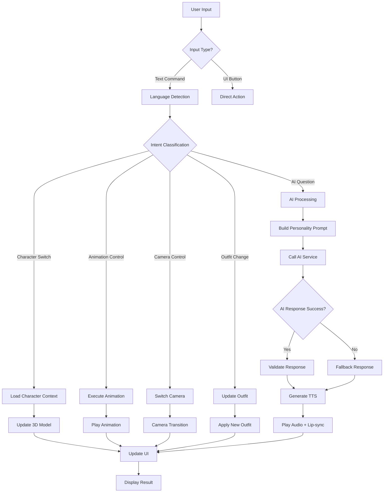
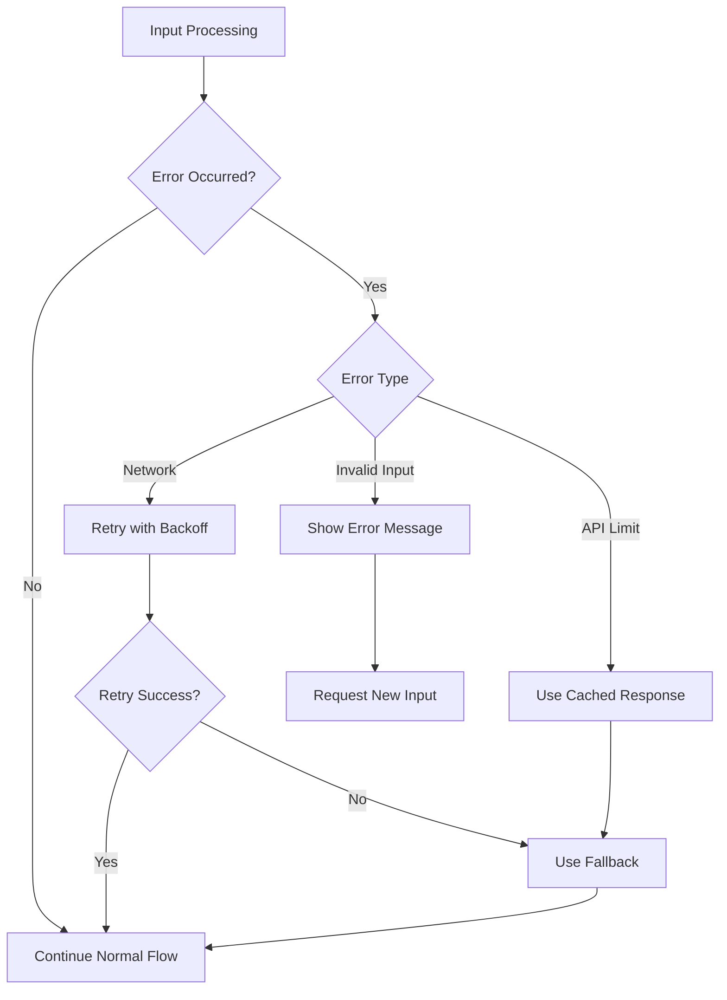

# 📋 3D MC Presenter PRO - Complete Process Chart

## 🎯 Tổng quan quy trình xử lý từ A-Z

---

## 🔄 Complete System Flowchart



---

## 📝 Detailed Step-by-Step Process

### Phase 1: Input Reception (0-100ms)

#### Step 1.1: Input Source Identification
```javascript
function identifyInputSource(input) {
  const sources = {
    TEXT_CHAT: 'text',
    UI_BUTTON: 'button',
    VOICE_COMMAND: 'voice',
    API_CALL: 'api'
  };
  
  return sources[input.type] || 'unknown';
}
```

#### Step 1.2: Input Validation
```javascript
function validateInput(input) {
  const validation = {
    notEmpty: input.trim().length > 0,
    maxLength: input.length <= 500,
    allowedChars: /^[a-zA-Z0-9\s\u00C0-\u017F]+$/.test(input),
    notSpam: !isSpam(input)
  };
  
  return Object.values(validation).every(Boolean);
}
```

### Phase 2: Intent Analysis (100-200ms)

#### Step 2.1: Language Detection
```javascript
function detectLanguage(text) {
  const vietnameseRatio = (text.match(/[àáạảãăằắẳẵâấầẩậêếềểễôốồổỗơớờởơưứừửữýỳ]/gi) || []).length / text.length;
  return vietnameseRatio > 0.3 ? 'vi' : 'en';
}
```

#### Step 2.2: Intent Classification Tree
```javascript
const INTENT_TREE = {
  CHARACTER: {
    patterns: /^(linh|mai|an|huong|giang|trang)$/i,
    action: 'switch_character',
    priority: 1
  },
  ANIMATION: {
    patterns: /(idle|nói|talk|giới thiệu|present|tay|gesture|đi|walk|nhảy|dance)/i,
    action: 'play_animation',
    priority: 2
  },
  CAMERA: {
    patterns: /(camera|máy quay)/i,
    action: 'switch_camera',
    priority: 3
  },
  OUTFIT: {
    patterns: /(quần áo|outfit|trang phục)/i,
    action: 'randomize_outfit',
    priority: 4
  },
  AI_QUESTION: {
    patterns: /.*/,
    action: 'ai_response',
    priority: 5
  }
};
```

#### Step 2.3: Entity Extraction
```javascript
function extractEntities(text, intent) {
  const extractors = {
    switch_character: () => text.toLowerCase().trim(),
    play_animation: () => extractAnimationName(text),
    switch_camera: () => null,
    randomize_outfit: () => null,
    ai_response: () => ({ question: text })
  };
  
  return extractors[intent]?.() || null;
}
```

### Phase 3: Context Processing (200-300ms)

#### Step 3.1: Character Context Loading
```javascript
function loadCharacterContext(characterId) {
  const character = CHARACTER_CONFIG[characterId];
  
  return {
    id: characterId,
    name: character.name,
    personality: character.personality,
    voice: VOICE_MAPPING[characterId],
    currentOutfit: getCurrentOutfit(characterId),
    animationState: getAnimationState(characterId),
    greeting: character.greeting,
    speakingStyle: PERSONALITY_TRAITS[character.personality]
  };
}
```

#### Step 3.2: Personality Prompt Building
```javascript
function buildPersonalityPrompt(context, question) {
  const personality = context.speakingStyle;
  
  const basePrompt = `Bạn là ${context.name}, một MC ${personality.role}.`;
  const stylePrompt = `Phong cách nói: ${personality.description}.`;
  const contextPrompt = context.currentOutfit ? `Bạn đang mặc ${context.currentOutfit}.` : '';
  const questionPrompt = `Hãy trả lời câu hỏi: ${question}`;
  
  return `${basePrompt} ${stylePrompt} ${contextPrompt} ${questionPrompt}`;
}
```

### Phase 4: Response Generation (300-4000ms)

#### Step 4.1: Immediate Action Execution
```javascript
function executeImmediateAction(intent, entities) {
  const actions = {
    switch_character: () => switchToCharacter(entities),
    play_animation: () => playAnimation(entities),
    switch_camera: () => switchCamera(),
    randomize_outfit: () => randomizeOutfit()
  };
  
  return actions[intent]?.() || null;
}
```

#### Step 4.2: AI Response Generation
```javascript
async function generateAIResponse(prompt, context) {
  try {
    const response = await callAIService({
      prompt: prompt,
      model: context.model || 'gemini-pro',
      temperature: context.temperature || 0.7,
      maxTokens: context.maxTokens || 1000,
      systemMessage: buildSystemMessage(context)
    });
    
    return processAIResponse(response, context);
  } catch (error) {
    return handleAIError(error, context);
  }
}
```

#### Step 4.3: Response Validation
```javascript
function validateResponse(response, context) {
  const validators = [
    validateLength,
    validateLanguage,
    validatePersonality,
    validateAppropriateness,
    validateCompleteness
  ];
  
  for (const validator of validators) {
    const result = validator(response, context);
    if (!result.valid) {
      return refineResponse(response, result.issues);
    }
  }
  
  return response;
}
```

### Phase 5: Multi-modal Output Generation (4000-5000ms)

#### Step 5.1: TTS Generation
```javascript
async function generateTTS(response, characterId) {
  const voiceConfig = {
    text: response,
    voice: VOICE_MAPPING[characterId],
    language: 'vi-VN',
    encoding: 'MP3',
    pitch: '+0st',
    speakingRate: '1.0'
  };
  
  try {
    const audioBuffer = await callTTSService(voiceConfig);
    return saveAudioFile(audioBuffer, characterId);
  } catch (error) {
    return handleTTSError(error);
  }
}
```

#### Step 5.2: Animation Synchronization
```javascript
function synchronizeAnimation(audioUrl, characterId) {
  // Start talk animation immediately
  playAnimation('talk', characterId);
  
  // Calculate speech duration
  const duration = estimateSpeechDuration(audioUrl);
  
  // Schedule animation end
  setTimeout(() => {
    playAnimation('idle', characterId);
  }, duration);
  
  // Setup lip-sync
  setupLipSync(audioUrl, characterId);
}
```

#### Step 5.3: UI Updates
```javascript
function updateUI(response, context) {
  const updates = {
    character: context.id,
    animation: 'talk',
    status: 'speaking',
    response: response.text,
    audioUrl: response.audioUrl,
    timestamp: Date.now()
  };
  
  dispatchUIUpdate(updates);
}
```

---

## 🎯 Decision Tree for Different Scenarios

### Scenario 1: Simple Command
```mermaid
graph TD
    A[Input: "Linh"] --> B{Intent: Character Switch}
    B --> C[Load Linh Context]
    C --> D[Switch 3D Model]
    D --> E[Update UI]
    E --> F[Show Confirmation]
```

### Scenario 2: Complex AI Question
```mermaid
graph TD
    A[Input: "Thời tiết hôm nay thế nào?"] --> B{Intent: AI Question}
    B --> C[Detect Language: Vietnamese]
    C --> D[Load Current Character Context]
    D --> E[Build Personality Prompt]
    E --> F[Call Gemini API]
    F --> G{Response Valid?}
    G -->|Yes| H[Generate TTS]
    G -->|No| I[Use Fallback]
    H --> J[Play Animation + Audio]
    I --> J
    J --> K[Update UI]
```

### Scenario 3: Error Handling


---

## 📊 Performance Metrics & Monitoring

### Response Time Breakdown
```
Input Processing:     0-100ms   (5%)
Intent Analysis:     100-200ms  (5%)
Context Loading:     200-300ms  (5%)
AI Generation:       300-3000ms (75%)
TTS Generation:      3000-4000ms (10%)
Output Processing:   4000-5000ms (5%)
```

### Quality Assurance Checkpoints
```javascript
const QUALITY_CHECKPOINTS = {
  INPUT_VALIDATION: {
    checkpoint: 'input_validation',
    metrics: ['length', 'characters', 'language'],
    threshold: 0.95
  },
  INTENT_ACCURACY: {
    checkpoint: 'intent_classification',
    metrics: ['precision', 'recall', 'f1_score'],
    threshold: 0.90
  },
  RESPONSE_QUALITY: {
    checkpoint: 'response_validation',
    metrics: ['relevance', 'coherence', 'personality_match'],
    threshold: 0.85
  },
  USER_SATISFACTION: {
    checkpoint: 'user_feedback',
    metrics: ['rating', 'helpfulness', 'accuracy'],
    threshold: 0.80
  }
};
```

---

## 🔄 Continuous Improvement Loop

### 1. Data Collection
```javascript
function collectInteractionData(input, response, metrics) {
  return {
    timestamp: Date.now(),
    input: {
      text: input.text,
      language: input.language,
      intent: input.intent,
      entities: input.entities
    },
    response: {
      text: response.text,
      audioUrl: response.audioUrl,
      animation: response.animation,
      responseTime: metrics.responseTime
    },
    context: {
      character: response.character,
      personality: response.personality,
      outfit: response.outfit
    },
    performance: {
      success: response.success,
      errors: response.errors,
      userSatisfaction: response.userSatisfaction
    }
  };
}
```

### 2. Analysis & Optimization
```javascript
function analyzePerformance(data) {
  const analysis = {
    averageResponseTime: calculateAverage(data, 'responseTime'),
    intentAccuracy: calculateAccuracy(data, 'intent'),
    userSatisfaction: calculateSatisfaction(data, 'userSatisfaction'),
    commonErrors: findCommonErrors(data),
    improvementAreas: identifyImprovements(data)
  };
  
  return generateOptimizationPlan(analysis);
}
```

### 3. Model Updates
```javascript
function updateModels(optimizationPlan) {
  const updates = {
    intentClassifier: retrainIntentClassifier(optimizationPlan.intentData),
    personalityPrompts: updatePersonalityPrompts(optimizationPlan.personalityData),
    responseValidation: adjustValidationRules(optimizationPlan.validationData),
    ttsOptimization: optimizeTTSSettings(optimizationPlan.ttsData)
  };
  
  return deployUpdates(updates);
}
```

---

## 🎯 Success Criteria

### Technical Metrics
- ✅ Response time < 5 seconds
- ✅ Intent accuracy > 95%
- ✅ System uptime > 99%
- ✅ Error rate < 1%

### User Experience Metrics
- ✅ User satisfaction > 4.5/5
- ✅ Task completion rate > 90%
- ✅ Return usage rate > 80%
- ✅ Support ticket reduction > 50%

### Business Metrics
- ✅ Stream quality improvement
- ✅ Audience engagement increase
- ✅ Production time reduction
- ✅ Cost efficiency improvement

---

**📋 Quy trình này đảm bảo hệ thống hoạt động nhất quán, hiệu quả và có thể cải tiến liên tục!**
