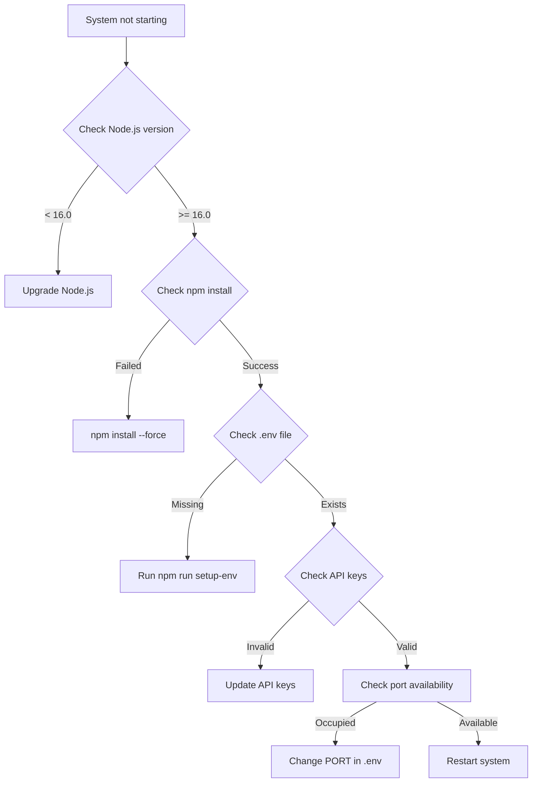
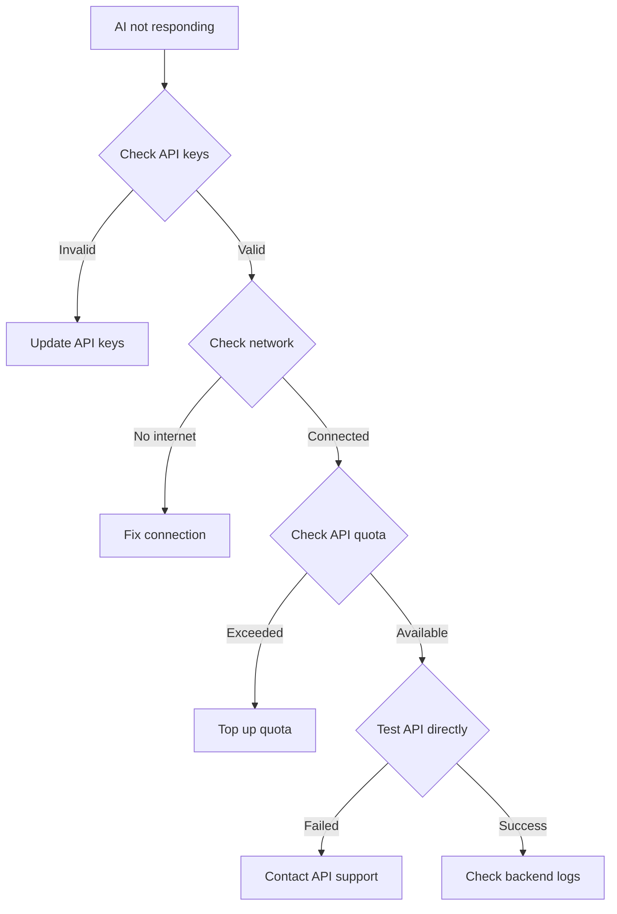
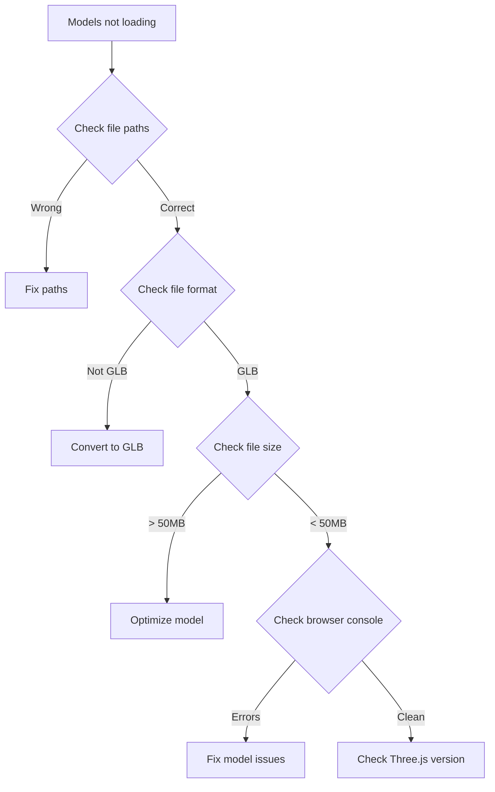

# 🚀 3D MC Presenter PRO - Complete Setup Guide

## 📋 Table of Contents
1. [System Overview](#system-overview)
2. [Prerequisites](#prerequisites)
3. [Setup Process](#setup-process)
4. [Configuration Steps](#configuration-steps)
5. [Testing & Verification](#testing--verification)
6. [Troubleshooting Flowchart](#troubleshooting-flowchart)
7. [Quick Reference](#quick-reference)

---

## 🎯 System Overview

### What is 3D MC Presenter PRO?
Một hệ thống MC ảo 3D chuyên nghiệp với:
- **6 nhân vật nữ** với tính cách riêng biệt
- **Wardrobe system** với trang phục thay đổi
- **AI Integration** (Gemini/OpenAI/Claude)
- **Lip-sync TTS** tự động
- **React-based UI** hiện đại
- **OBS Integration** cho livestream

### System Architecture
```
┌─────────────────┐    ┌─────────────────┐    ┌─────────────────┐
│   React UI      │    │  Backend API    │    │   AI Services   │
│                 │    │                 │    │                 │
│ • Characters    │◄──►│ • Express.js    │◄──►│ • Gemini        │
│ • Wardrobe      │    │ • AI Router     │    │ • OpenAI        │
│ • Controls      │    │ • TTS Handler   │    │ • Claude        │
│ • 3D Scene      │    │ • File Upload   │    │ • Google TTS    │
└─────────────────┘    └─────────────────┘    └─────────────────┘
```

---

## 📚 Prerequisites

### Required Software
```bash
# Check Node.js version (must be 16.0+)
node --version

# Check npm version
npm --version

# Check Git version
git --version
```

### Required Accounts & APIs
1. **Google Account** - Cho Gemini API & TTS
2. **Google Cloud Project** - Cho Text-to-Speech API
3. **Optional**: OpenAI Account (nếu dùng GPT)
4. **Optional**: Anthropic Account (nếu dùng Claude)

### System Requirements
- **RAM**: 8GB+ (recommended)
- **Storage**: 2GB+ free space
- **Browser**: Chrome/Firefox/Edge (latest)
- **OS**: Windows 10+, macOS 10.15+, Ubuntu 18.04+

---

## 🔄 Setup Process

### Phase 1: Environment Setup (5 minutes)

#### Step 1.1: Clone Repository
```bash
git clone https://github.com/Nhatlinh9898/automatic-succotash.git
cd "linh20220211/javascript/java/tao mo hinh 3D"
```

#### Step 1.2: Install Dependencies
```bash
npm install
```

#### Step 1.3: Environment Configuration
**Option A - Interactive (Recommended for beginners):**
```bash
npm run setup-env
```
Follow prompts để nhập API keys.

**Option B - Manual (Recommended for advanced users):**
```bash
npm run copy-env
# Edit .env file với API keys của bạn
```

**Option C - Template (For production):**
```bash
cp .env.full .env
# Edit với full configuration
```

### Phase 2: API Keys Setup (10 minutes)

#### Step 2.1: Get Gemini API Key
1. Truy cập: https://aistudio.google.com/
2. Đăng nhập bằng Google account
3. Click "Get API Key"
4. Copy key vào `GEMINI_API_KEY` trong .env

#### Step 2.2: Get Google TTS API Key
1. Truy cập: https://console.cloud.google.com/
2. Tạo project mới
3. Enable "Cloud Text-to-Speech API"
4. Tạo Service Account Key
5. Copy key vào `TTS_API_KEY` trong .env

#### Step 2.3: Optional AI Keys
**OpenAI (nếu cần):**
1. Truy cập: https://platform.openai.com/
2. Đăng nhập và tạo API key
3. Nạp tiền vào account (minimum $5)
4. Copy key vào `OPENAI_API_KEY`

**Claude (nếu cần):**
1. Truy cập: https://console.anthropic.com/
2. Đăng nhập và tạo API key
3. Copy key vào `CLAUDE_API_KEY`

### Phase 3: Model Preparation (5 minutes)

#### Step 3.1: Create Character Models Directory
```bash
mkdir -p characters
mkdir -p public/audio
```

#### Step 3.2: Prepare 3D Models
Đặt các file model vào thư mục `characters/`:
```
characters/
├── female1.glb  # Linh - Professional MC
├── female2.glb  # Mai - Creative MC
├── female3.glb  # An - Academic MC
├── female4.glb  # Huong - Elegant MC
├── female5.glb  # Giang - Tech MC
└── female6.glb  # Trang - Energetic MC
```

**Model Requirements:**
- Format: GLB/GLTF 2.0
- Size: < 50MB
- Include animations: idle, talk, present, gesture, walk, dance
- Include jaw bone cho lip-sync

#### Step 3.3: Fallback Models (Optional)
Nếu không có model, hệ thống sẽ tự động tạo placeholder characters.

### Phase 4: System Launch (2 minutes)

#### Step 4.1: Start Backend Server
```bash
npm run ai-server
```
Server sẽ chạy trên port 3001.

#### Step 4.2: Start React Frontend
```bash
# Terminal mới
npm run dev:mc3d
```
Frontend sẽ chạy trên port 3000.

#### Step 4.3: Verify System
- Backend: http://localhost:3001/api/health
- Frontend: http://localhost:3000
- Character System: http://localhost:3000/characters
- MC Presenter: http://localhost:3000/presenter

---

## ⚙️ Configuration Steps

### Step 1: Verify Environment Variables
Check tất cả required variables trong .env:
```bash
grep -E "(AI_PROVIDER|GEMINI_API_KEY|TTS_API_KEY)" .env
```

### Step 2: Test API Connections
```bash
# Test backend health
curl http://localhost:3001/api/health

# Test character configuration
curl http://localhost:3001/api/characters
```

### Step 3: Configure Features
Enable/disable features trong .env:
```env
ENABLE_AI_RESPONSES=true
ENABLE_TTS=true
ENABLE_LIP_SYNC=true
ENABLE_CHARACTER_SWITCHING=true
ENABLE_OUTFIT_CUSTOMIZATION=true
```

### Step 4: Customize Default Settings
```env
DEFAULT_CHARACTER=female1
DEFAULT_OUTFIT=casual
DEFAULT_HAIR=long
DEFAULT_ACCESSORY=none
DEFAULT_COLOR=#ff6b6b
```

---

## 🧪 Testing & Verification

### Test 1: Basic Functionality
1. Mở http://localhost:3000/characters
2. Verify character selection works
3. Test outfit customization
4. Check 3D scene rendering

### Test 2: AI Integration
1. Mở http://localhost:3000/presenter
2. Type test message: "Xin chào"
3. Verify AI response
4. Check TTS audio playback
5. Verify lip-sync animation

### Test 3: Character Switching
1. Try commands: "Linh", "Mai", "An"
2. Verify character models load
3. Check voice changes
4. Test personality responses

### Test 4: OBS Integration
1. Mở OBS
2. Add Browser Source
3. URL: http://localhost:3000/presenter
4. Size: 1920x1080
5. Verify rendering in OBS

### Test 5: Performance Check
- Monitor FPS (target: 60fps)
- Check memory usage
- Verify API response times
- Test with multiple animations

---

## 🔧 Troubleshooting Flowchart

### Issue: System Not Starting


### Issue: AI Not Responding


### Issue: 3D Models Not Loading


---

## 📋 Quick Reference

### Essential Commands
```bash
# Setup
npm run setup-env          # Interactive setup
npm run copy-env           # Copy template
npm install               # Install dependencies

# Development
npm run dev:mc3d          # React frontend
npm run ai-server         # Backend API
npm run dev:full          # Both together

# Testing
curl http://localhost:3001/api/health
curl http://localhost:3001/api/characters

# Troubleshooting
npm run ai-server         # Check backend logs
npm run dev:mc3d          # Check frontend logs
```

### Important URLs
- **Frontend**: http://localhost:3000
- **Character System**: http://localhost:3000/characters
- **MC Presenter**: http://localhost:3000/presenter
- **API Health**: http://localhost:3001/api/health
- **Character Config**: http://localhost:3001/api/characters

### File Locations
```
├── .env                   # Environment variables
├── characters/            # 3D model files
├── public/audio/         # TTS audio files
├── src/components/       # React components
├── server.js             # Backend API
└── character-config.json # Character definitions
```

### Common Issues & Solutions
| Issue | Cause | Solution |
|-------|--------|----------|
| "API key invalid" | Wrong key | Check .env file |
| "TTS not working" | No billing | Enable Google Cloud billing |
| "Model not loading" | Wrong path | Check characters/ folder |
| "Cannot connect" | Port conflict | Change PORT in .env |
| "Laggy animation" | Heavy model | Optimize 3D model |

---

## 🎯 Success Checklist

Before going live, verify:

### ✅ Setup Checklist
- [ ] Node.js 16.0+ installed
- [ ] All dependencies installed
- [ ] .env file configured with API keys
- [ ] Backend server running on port 3001
- [ ] Frontend running on port 3000
- [ ] 3D models in characters/ folder
- [ ] API health check passing

### ✅ Functionality Checklist
- [ ] Character selection works
- [ ] Outfit customization works
- [ ] AI responses working
- [ ] TTS audio playing
- [ ] Lip-sync animation working
- [ ] Camera transitions smooth
- [ ] OBS integration working

### ✅ Performance Checklist
- [ ] 60fps animation
- [ ] < 2s API response time
- [ ] < 500MB memory usage
- [ ] No console errors
- [ ] Smooth character switching

---

## 🚀 Going Live

### Step 1: Final Testing
Run complete test suite:
```bash
# Test all endpoints
curl http://localhost:3001/api/health
curl http://localhost:3001/api/characters

# Test frontend
# Open http://localhost:3000 in browser
# Test all features
```

### Step 2: OBS Setup
1. Open OBS
2. Add Browser Source
3. URL: http://localhost:3000/presenter
4. Width: 1920, Height: 1080
5. Custom CSS: `body { margin: 0; overflow: hidden; }`

### Step 3: Stream Preparation
- Test audio levels
- Verify lighting in 3D scene
- Check character animations
- Prepare chat commands
- Test backup systems

### Step 4: Go Live
- Start OBS stream
- Test MC interaction
- Monitor system performance
- Engage with audience

---

## 📞 Support Resources

### Documentation
- [Complete Guide](./README-COMPLETE.md)
- [API Reference](./API-REFERENCE.md)
- [Troubleshooting](./TROUBLESHOOTING.md)

### Quick Help
```bash
# Check system status
npm run ai-server & npm run dev:mc3d

# Common fixes
npm install --force
rm -rf node_modules package-lock.json && npm install

# Reset environment
cp .env.setup .env && npm run setup-env
```

### Community Support
- GitHub Issues: Report bugs
- Discord: Live chat support
- Documentation: Detailed guides

---

**🎭 Ready to create amazing 3D MC presentations!**

*Last updated: February 2024*
